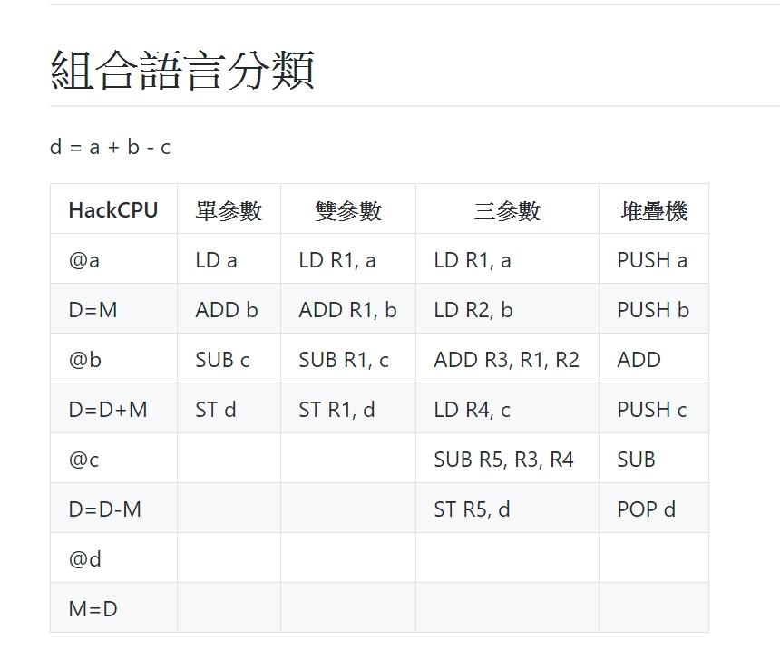

# 組合語言分類



##　
```
#include <stdio.h>
#include <stdlib.h>

char *readText(char *fileName) {
  FILE *file = fopen(fileName, "r"); // 開檔
  fseek(file, 0L, SEEK_END);         // 移到檔尾
  int size = ftell(file);            // 取得檔尾位置
  fseek(file, 0L, SEEK_SET);         // 移回檔首         //L 可加可不加
  char *text = malloc(size+1);       // 配置剛好大小的字串空間！
  fread(text, 1, size, file);        // 讀取整個檔案到字串中,每個是1 byte,改sizeof(char)
  text[size] = '\0';                 // 設定字串結尾
  fclose(file);                      // 關閉檔案
  return text;                       // 傳回字串
}

int main(int argc, char *argv[]) {
  char *text = readText(argv[1]);    // 讀入整個檔案成為字串
  printf("%s\n", text);              // 印出該字串
  free(text);                        // 釋放該字串的記憶體
}

```

### 結尾
* C
hello!\0

* pascell
hello!   ,6  會將長度記住


## incline
* 內嵌語言
```
#include <stdio.h>
#include <stdint.h>

int main(int argc, char **argv)
{
    int32_t var1=10, var2=20, sum = 0;
    asm volatile ("addl %%ebx,%%eax;"    
                 : "=a" (sum)              /* output: sum = EAX */
                 : "a" (var1), "b" (var2)  /* inputs: EAX = var1, EBX = var2 */
    );
    printf("sum = %d\n", sum);
    return 0;
}

```